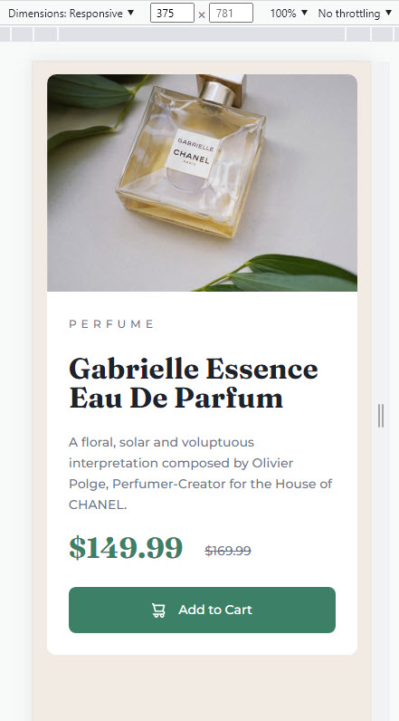
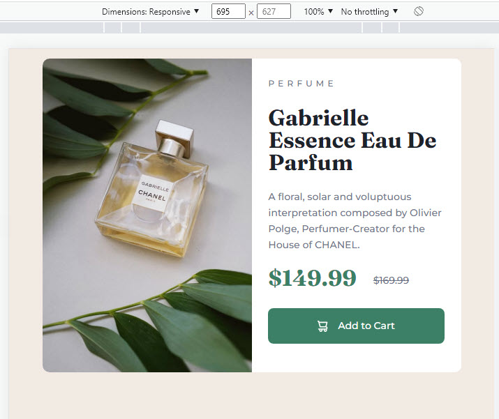

# Frontend Mentor - Product preview card component solution

This is a solution to the [Product preview card component challenge on Frontend Mentor](https://www.frontendmentor.io/challenges/product-preview-card-component-GO7UmttRfa). Frontend Mentor challenges help you improve your coding skills by building realistic projects. 

## Table of contents

- [Overview](#overview)
  - [The challenge](#the-challenge)
  - [Screenshot](#screenshot)
  - [Links](#links)
- [My process](#my-process)
  - [Built with](#built-with)
  - [What I learned](#what-i-learned)
  - [Continued development](#continued-development)
  - [Useful resources](#useful-resources)
- [Author](#author)
- [Acknowledgments](#acknowledgments)

**Note: Delete this note and update the table of contents based on what sections you keep.**

## Overview

### The challenge

Users should be able to:

- View the optimal layout depending on their device's screen size
- See hover and focus states for interactive elements

### Screenshot




### Links

## My process

### Built with

- Semantic HTML5 markup
- CSS custom properties
- Flexbox
- CSS Grid
- Mobile-first workflow

**Note: These are just examples. Delete this note and replace the list above with your own choices**

### What I learned

Tried to improve my skills when working with images and and different screen sizes.

```html
<picture>
        <source media="(min-width:660px)" srcset="images/image-product-desktop.jpg">
        
      </picture>
```


If you want more help with writing markdown, we'd recommend checking out [The Markdown Guide](https://www.markdownguide.org/) to learn more.

**Note: Delete this note and the content within this section and replace with your own learnings.**

### Continued development


**Note: Delete this note and the content within this section and replace with your own plans for continued development.**

### Useful resources

- [W3schools srcset attribute](https://www.w3schools.com/tags/att_source_srcset.asp) - This helped me for changing img source base on the screen width. I was unfamiliar with the srcset attribute.


**Note: Delete this note and replace the list above with resources that helped you during the challenge. These could come in handy for anyone viewing your solution or for yourself when you look back on this project in the future.**

## Author


- Frontend Mentor - [@cyberic67](https://www.frontendmentor.io/profile/cyberic67)


**Note: Delete this note and add/remove/edit lines above based on what links you'd like to share.**

## Acknowledgments

Thanks to Kevin Powell for his awesome YouTube video on CSS.

**Note: Delete this note and edit this section's content as necessary. If you completed this challenge by yourself, feel free to delete this section entirely.**
